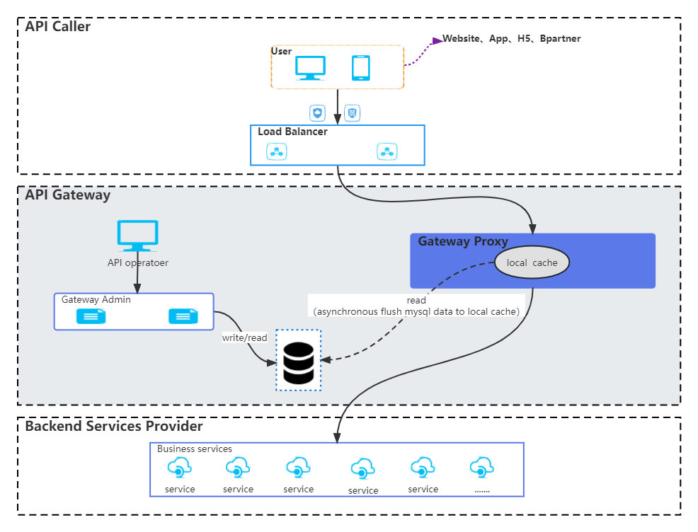

English | [简体中文](README.md)

# Overview

_High-performance & scalable http gateway ._

**Background & Motivation**

With the following questions, Api gateway was born:

- How to protect the background services in interface level security.
- How many apis does your system have?
- How many apis are involved in each business process?
- How many apis does the system provide for each caller?
- What is the error rate and request time (Avg,Max) per api?

If you have these problems, it may help you.

**Architecture**



1. Middleware dependencies

| Middleware | Startup | Runtime | Usage                    |
|------------|---------|---------|--------------------------|
| MySQL      | √       | ×       | Api meta data storages   |
| Redis      | √       | ×       | Distributed rate limiter |

2. Environment requirements

- Go version  
  go 1.16+
- OS  
  linux、macos、windows

**Features**

- Interface level security
- Progressive release api
- Restful API forwarding support
- Rate limit
- API Breaker
- Fallback
- Timeout control
- OAuth2.0 client credential support
- Parameters ignore
- Group by api
- Gray rules
- Monitor
- Api document management

**Key concepts**

- Environment
- API group
- Upstream service
- Tenant
- API

**Quick Start**

1. Startup middlewares  
   MySql、Redis execute gateway.sql in MySql
2. Deploy  
   Run docker Makefile
3. Startup gateway Two boot modes are supported:

```agsl
1. By local configuration(config.toml)
    Default mode
    Start command: ./api-gateway
2. By remote configuration
    Currently, [nacos](https://github.com/alibaba/nacos) is supported in this mode.
    Start command: ./api-gateway -CONFIG_MODE=nacos -NACOS_ADDRESS=127.0.0.1:8888 -NACOS_NAMESPACE=dev -NACOS_DATAID=api-gateway 
    -NACOS_GROUP=DEFAULT_GROUP
    
```

**Best practice**


**Performance**

Stress test tools : Apache bench httpd-tools ab test.  
Back api uri: /upstream-service-test/outer/resources/{{resourceId}}  
Api gateway uri: /upstream-service-test/resources/{{resourceId}}  
Request method: GET  
Response body content:

```json
{
  "code": "200000",
  "msg": "Success",
  "data": {
    "dictKey": "GENDER",
    "keyDisplayName": "性别",
    "dictCodes": [
      {
        "dictCode": "MALE",
        "dictValue": "1",
        "dictOrder": 1,
        "isDefault": true,
        "codeDisplayName": "男"
      },
      {
        "dictCode": "FEMALE",
        "dictValue": "2",
        "dictOrder": 2,
        "isDefault": false,
        "codeDisplayName": "女"
      }
    ]
  },
  "success": true
}
```

| Server         | Usage                     | Resources     |
|----------------|---------------------------|---------------|
| 192.168.45.19  | Stress test tools machine | Aliyun 8C 16G |
| 192.168.45.141 | Api gateway               | Aliyun 8C 16G | 
| 192.168.45.142 | Backend upstream service  | Aliyun 8C 16G | 

| Scenario                       | Rate limiter switch | Monitor switch | concurrency | Request Count | Error rate | CPU(%) | Memory(%) | Command                                                                                                          |
|--------------------------------|---------------------|----------------|-------------|---------------|------------|--------|-----------|------------------------------------------------------------------------------------------------------------------|
| Stress request backend service | ×                   | ×              | 200         | 500000        | 0%         | 450%   | 0.1       | ab -c 200 -n 500000 -H 'G-Tenant:website' http://192.168.45.142:8888/upstream-service-test/outer/resources/12345 | 
| Stress request api gateway     | ×                   | ×              | 200         | 500000        | 0%         | 610%   | 0.1       | ab -c 200 -n 500000 -H 'G-Tenant:website' http://192.168.45.141:7777/upstream-service-test/resources/12345       | 
| Stress request api gateway     | ×                   | √              | 200         | 500000        | 0%         | 610%   | 0.1       | ab -c 200 -n 500000 -H 'G-Tenant:website' http://192.168.45.141:7777/upstream-service-test/resources/12345       | 
| Stress request api gateway     | √                   | ×              | 200         | 500000        | 0%         | 610%   | 0.1       | ab -c 200 -n 500000 -H 'G-Tenant:website' http://192.168.45.141:7777/upstream-service-test/resources/12345       | 
| Stress request api gateway     | √                   | √              | 200         | 500000        | 0%         | 610%   | 0.1       | ab -c 200 -n 500000 -H 'G-Tenant:website' http://192.168.45.141:7777/upstream-service-test/resources/12345       | 
