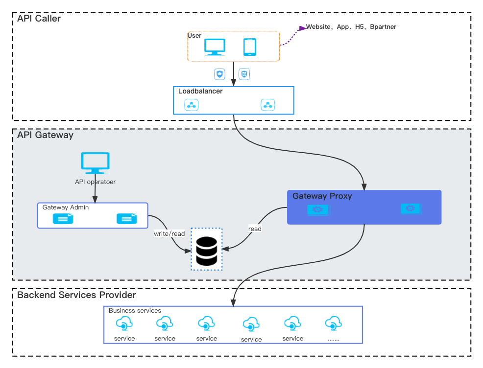
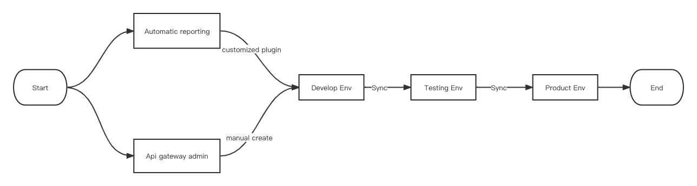

简体中文 | [English](README-EN.md)

# Overview

_高性能可扩展弹性部署的Http网关_

**背景**

With the following questions, Api gateway was born:

- How to protect the background services in interface level security.
- How many apis does your system have?
- How many apis are involved in each business process?
- How many apis does the system provide for each caller?
- What is the error rate and request time (Avg,Max) per api?

If you have these problems, it may help you.

**架构**



1. 中间件依赖

| Middleware | Startup | Runtime | Usage                    |
|------------|---------|---------|--------------------------|
| MySQL      | √       | ×       | Api meta data storages   |
| Redis      | √       | ×       | Distributed rate limiter |

2. 部署环境

- Go 版本   
  go 1.16+
- 操作系统    
  linux、macos、windows

**特性**

- 接口级安全控制
- API渐进式发布
- Restful API 转发支持
- 限流
- 熔断
- 降级
- 超时控制
- OAuth2.0 客户端鉴权
- 参数过滤
- API分组
- 灰度
- 监控
- API文档生成

**核心概念**

- 环境
- API分组
- 上游应用
- 租户
- API接口

**快速通道**

1. 启动依赖中间件  
   MySql、Redis execute gateway.sql in MySql
2. 生成镜像  
   Run docker Makefile
3. 启动网关  
   Two boot modes are supported:

```agsl
1. By local configuration(config.toml)
    Default mode
    Start command: ./api-gateway
2. By remote configuration
    Currently, [nacos](https://github.com/alibaba/nacos) is supported in this mode.
    Start command: ./api-gateway -CONFIG_MODE=nacos -NACOS_ADDRESS=127.0.0.1:8888 -NACOS_NAMESPACE=dev -NACOS_DATAID=api-gateway 
    -NACOS_GROUP=DEFAULT_GROUP
    
```

**最佳实践**



**性能**

压测工具 : Apache bench httpd-tools ab test.  
后端接口: /upstream-service-test/outer/resources/{{resourceId}}  
网关转发接口: /upstream-service-test/resources/{{resourceId}}  
请求方法: GET  
响应内容:

```json
{
  "code": "200000",
  "msg": "Success",
  "data": {
    "dictKey": "GENDER",
    "keyDisplayName": "性别",
    "dictCodes": [
      {
        "dictCode": "MALE",
        "dictValue": "1",
        "dictOrder": 1,
        "isDefault": true,
        "codeDisplayName": "男"
      },
      {
        "dictCode": "FEMALE",
        "dictValue": "2",
        "dictOrder": 2,
        "isDefault": false,
        "codeDisplayName": "女"
      }
    ]
  },
  "success": true
}
```

| 服务器         | 用途                     | 资源     |
|----------------|---------------------------|---------------|
| 192.168.45.19  | 压测机 | Aliyun 8C 16G |
| 192.168.45.141 | API网关               | Aliyun 8C 16G | 
| 192.168.45.142 | 上游后端服务           | Aliyun 8C 16G | 

| 场景                       | 开启限流 | 开启监控 | 并发数 | 请求总量 | 错误率 | CPU(%) | 内存(%) | 压测指令                                                                                                          |
|--------------------------------|---------------------|----------------|-------------|---------------|------------|--------|-----------|------------------------------------------------------------------------------------------------------------------|
| 直接压测后端服务 | ×                   | ×              | 200         | 500000        | 0%         | 450%   | 0.1       | ab -c 200 -n 500000 -H 'G-Tenant:website' http://192.168.45.142:8888/upstream-service-test/outer/resources/12345 | 
| 压测API网关     | ×                   | ×              | 200         | 500000        | 0%         | 610%   | 0.1       | ab -c 200 -n 500000 -H 'G-Tenant:website' http://192.168.45.141:7777/upstream-service-test/resources/12345       | 
| 压测API网关     | ×                   | √              | 200         | 500000        | 0%         | 610%   | 0.1       | ab -c 200 -n 500000 -H 'G-Tenant:website' http://192.168.45.141:7777/upstream-service-test/resources/12345       | 
| 压测API网关     | √                   | ×              | 200         | 500000        | 0%         | 610%   | 0.1       | ab -c 200 -n 500000 -H 'G-Tenant:website' http://192.168.45.141:7777/upstream-service-test/resources/12345       | 
| 压测API网关     | √                   | √              | 200         | 500000        | 0%         | 610%   | 0.1       | ab -c 200 -n 500000 -H 'G-Tenant:website' http://192.168.45.141:7777/upstream-service-test/resources/12345       | 
