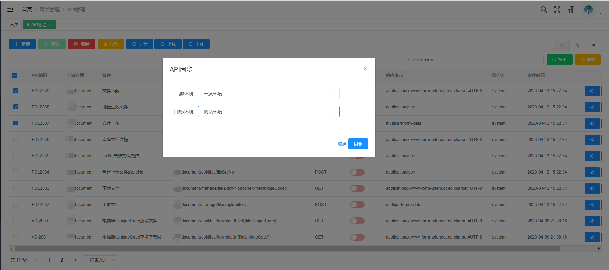
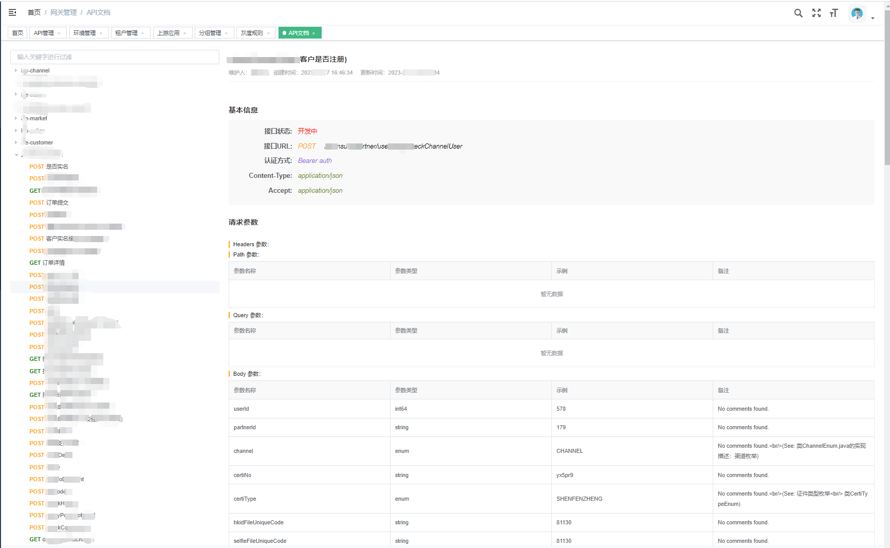

简体中文 | [English](README-EN.md)


# 概览

_高性能可扩展弹性部署的HTTP网关_

### 背景

可视化 & 可配置化解决如下问题:

- 接口级安全控制
- API监控治理
    - 系统有多少API？
    - 每个业务流程涉及哪些API？
    - 每个API的错误比率和请求时间 (均值、最大值) 情况？
- 灰度发布
    - 强化上线生产治理，减少新feature上线对客户造成的影响。
    - 屏蔽客户端与服务端差异，能够在不对外部绑定客户端产生负面影响的情况下重构后台服务。
- 开发提效
    - API通用功能处理：限流、熔断、降级、超时、参数过滤、客户端鉴权。
    - 减少客户端和服务端的直接调用，通用功能不需要每个后台服务实现一遍。
- 增强可测试性
    - 通过API接口hack、API最新元数据自动更新等功能，模拟或虚拟化服务，以验证设计要求或协助测试，提高研发效率。

### 架构


1. 中间件依赖

| 中间件   | 启动时 | 运行时 | 用途       |
|-------|-----|-----|----------|
| MySQL | 强   | 弱   | API元数据存储 |
| Redis | 强   | 弱   | 分布式限流    |

> 强：中间件不可用时，网关无法启动  
> 弱：出现故障时，不影响网关对外提供服务
> > Redis不可用时，分布式流控会降级为本地流控   
> > MySQL不可用时，API数据实时性可能会有影响  
> > 中间件不可用时，有监控数据上报   
> > 中间件恢复可用时，网关相关功能会自恢复

2. 部署环境

- Go 版本   
  go 1.16+
- 操作系统    
  linux、macos、windows

### 特性列表

- [接口级安全控制](docs/feature.md#接口级安全控制)
- [API渐进式发布](docs/feature.md#API渐进式发布)
- [Restful API 转发支持](docs/feature.md#Restful_API转发支持)
- [限流](docs/feature.md#限流)
- [熔断](docs/feature.md#熔断)
- [降级](docs/feature.md#降级)
- [超时控制](docs/feature.md#超时控制)
- [客户端鉴权](docs/feature.md#客户端鉴权)
- [参数过滤](docs/feature.md#参数过滤)
- [API分组](docs/feature.md#API分组)
- [灰度](docs/feature.md#灰度)
- [监控](docs/feature.md#监控)
- [API文档生成](docs/feature.md#API文档生成)

**核心概念**

- 环境
- API分组
- 上游应用
- 租户
- API接口

### 快速启动

1. 启动依赖中间件  
   启动MySql，运行gateway.sql  
   启动Redis

2. 生成镜像  
   docker 运行 Makefile
3. 启动网关  
   支持两种启动方式：

> (1) 本地配置文件(config.toml)  
> 默认启动方式，启动命令：./api-gateway

> (2) 远程配置文件  
> 目前仅支持： [nacos](https://github.com/alibaba/nacos)  
> 启动命令： ./api-gateway -CONFIG_MODE=nacos -NACOS_ADDRESS=127.0.0.1:8888 -NACOS_NAMESPACE=dev -NACOS_DATAID=api-gateway
> -NACOS_GROUP=DEFAULT_GROUP

### 最佳实践

- API上线流程：

设计->开发->测试->上线->下线

- 服务列表：

| 服务名称                  | 开发语言    | 描述                           |
|-----------------------|---------|------------------------------|
| api-gateway           | go      | 网关服务                         |
| api-gateway-admin     | java    | 网关后管后台                       | 
| api-gateway-font      | js、html | 网关后管页面                       | 
| upstream-service-demo | java    | 模拟后端springboot web微服务提供API接口 |

- 上报API信息有两种方式:

1、开发maven插件jar（api-gateway-reporter），deploy 到maven 仓库
> 原理：集成运维平台maven编译阶段扫描springboot-demo项目api信息，并自动上报到api-gateway-admin
>
> 备注：实现基于开源工具，感谢[smart-doc-maven-plugin](https://github.com/smart-doc-group/smart-doc-maven-plugin)，
> [smart-doc](https://github.com/smart-doc-group/smart-doc)是一款同时支持JAVA REST API和Apache Dubbo RPC接口文档生成的工具

2、登录后管界面人工录入

> 第一种方式相对于第二种方案的优点：
>
> (1) 节省了人工录入成本
>
> (2) API文档实现了自动更新，节省了API文档维护成本

- 管控平台操作示例图：

1. API信息查询
   
2. API信息同步
   
3. API租户信息管理
   
4. API文档预览
   
   

### 性能

压测工具 : Apache bench httpd-tools ab test

后端接口: /upstream-service-test/outer/resources/{{resourceId}}

网关转发接口: /upstream-service-test/resources/{{resourceId}}

请求方法: GET

响应内容:

```json
{
  "code": "200000",
  "msg": "Success",
  "data": {
    "dictKey": "GENDER",
    "keyDisplayName": "性别",
    "dictCodes": [
      {
        "dictCode": "MALE",
        "dictValue": "1",
        "dictOrder": 1,
        "isDefault": true,
        "codeDisplayName": "男"
      },
      {
        "dictCode": "FEMALE",
        "dictValue": "2",
        "dictOrder": 2,
        "isDefault": false,
        "codeDisplayName": "女"
      }
    ]
  },
  "success": true
}
```

| 服务器            | 用途     | 资源         |
|----------------|--------|------------|
| 192.168.45.19  | 压测机    | 阿里云 8C 16G |
| 192.168.45.141 | API网关  | 阿里云 8C 16G | 
| 192.168.45.142 | 上游后端服务 | 阿里云 8C 16G | 

| 场景      | 开启限流 | 开启监控 | 并发数 | 请求总量   | 错误率 | CPU(%) | 内存(%) | QPS      | 压测指令                                                                                                             |
|---------|------|------|-----|--------|-----|--------|-------|----------|------------------------------------------------------------------------------------------------------------------|
| 压测后端服务  | ×    | ×    | 200 | 500000 | 0%  | 450%   | 0.1   | 22194.36 | ab -c 200 -n 500000 -H 'G-Tenant:website' http://192.168.45.142:8888/upstream-service-test/outer/resources/12345 | 
| 压测API网关 | ×    | ×    | 200 | 500000 | 0%  | 610%   | 0.1   | 15370.83 | ab -c 200 -n 500000 -H 'G-Tenant:website' http://192.168.45.141:7777/upstream-service-test/resources/12345       | 
| 压测API网关 | ×    | √    | 200 | 500000 | 0%  | 610%   | 0.1   | 13141.76 | ab -c 200 -n 500000 -H 'G-Tenant:website' http://192.168.45.141:7777/upstream-service-test/resources/12345       | 
| 压测API网关 | √    | ×    | 200 | 500000 | 0%  | 610%   | 0.1   | 11361.08 | ab -c 200 -n 500000 -H 'G-Tenant:website' http://192.168.45.141:7777/upstream-service-test/resources/12345       | 
| 压测API网关 | √    | √    | 200 | 500000 | 0%  | 610%   | 0.1   | 10595.93 | ab -c 200 -n 500000 -H 'G-Tenant:website' http://192.168.45.141:7777/upstream-service-test/resources/12345       | 
